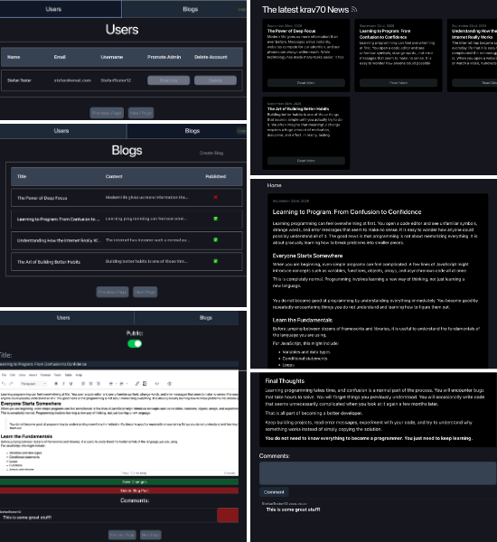

# Blog-API

A Blog-API application consisting of a backend, client-facing app, and an admin portal.

## For the backend the following technlogies were used:
- NodeJS/Express - Backend
- JWT/Passport - Authentication
- Postgress - Database
- Prisma - ORM
- CORS
- Render - Backend/Database Deployment

## For the client/admin the following technlogies were used:
- Vite - bundler
- React - Framework
- React-Router - Routing
- Tailwind - Styles
- HTTP - requests/api
- TinyMC - In browser Text Editor
- lucide-react - Icons
- Vercel - Deployment

#### Preview [admin!](https://blog-api-admin-snowy.vercel.app/auth/login)

#### Preview [client!](https://blog-api-frontend-eta.vercel.app/blogs)

### Preview of the interfaces

