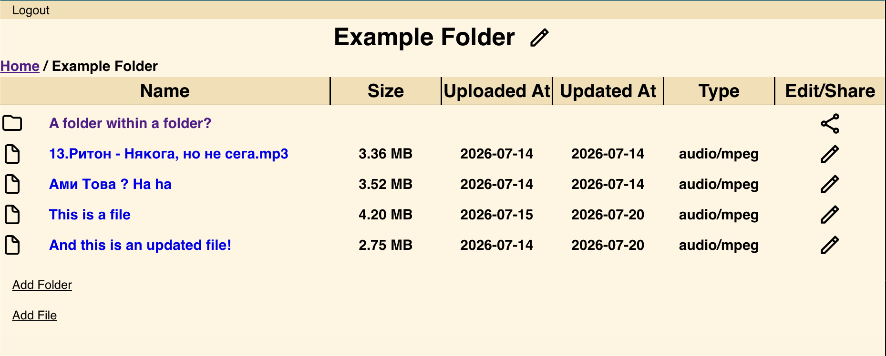

# File-Upload

## The following tools were used in the making of this project

### node, express - controllers logic, routes, general backend config
### ejs - viws
### multer - file manipulation
### prisma - ORM
### postgresql - database
### supabase - file storage/buckets
### passport - authentication

## Preview

#### You can check out the app using the link in the sidebar or by clicking [here](https://file-upload-g3qq.onrender.com)!

##### Deployment from [render!](https://render.com)